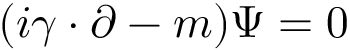

<section>

	
Die <a href="{{ "/t6-quantenmechanik.html" | relative_url }}">Quantenmechanik</a> wurde in den 1920er Jahren zunächst im nichtrelativistischen Limesbereich <i>c</i>-1=0 formuliert, obwohl die Richtigkeit von Einsteins <a href="{{ "/t4-spezielle-relativitaetstheorie.html" | relative_url }}">Spezieller Relativitätstheorie</a> bereits seit Jahren, von einigen antisemitischen Idioten abgesehen, allgemein anerkannt war. Dirac gelang es 1928, eine eigenartige relativistische Wellengleichung aufzustellen, die die Schrödinger-Gleichung nichttrivial verallgemeinerte. Insbesondere erklärte sie den Spin des Elektrons und sagte dessen Antiteilchen voraus. Ein Triumph war die experimentelle Bestätigung dieses Positrons durch Carl Anderson 1932. Allerdings führte die Interpretation der Dirac-Gleichung als Wellengleichung zu Widersprüchen. Zudem ergaben sich Probleme bei der Quantisierung der Elektrodynamik, die ebenfalls eine <i>c</i>-1=1 Theorie ist. Als Ausweg wurde die Quantenfeldtheorie als eine relativistisch konsistente Vielteilchentheorie entwickelt. Diese führte zum Standardmodell der Elementarteilchen, das alle Naturkräfte mit Ausnahme der Gravitation präzise beschreibt.

	

	<h4>Quantenfeldtheorie</h4>

	
Die direkte Verallgemeinerung der quantenmechanischen, Galilei-invarianten Schrödinger-Gleichung für die Wahrscheinlichkeitsamplitude ψ eines freien Teilchens der Masse <i>m</i> führt zur Lorentz-invarianten Klein-Gordon Gleichung

	

		<table>
			<tbody>
				<tr>
					<td></td>
					<td style="vertical-align:middle">Klein-Gordon-Gleichung</td>
				</tr>
			</tbody>
		</table>
	

	
Die relativistischen Symmetrien zwischen Raum und Zeit sind wiederhergestellt, denn sowohl die zeitliche als auch alle Ableitungen nach den Raumkoordinaten <i>x</i>, <i>y</i>, <i>z</i> sind nun zweiter Ordnung. Zudem hat sich im Vergleich zur Schrödinger-Gleichung die Lichtgeschwindigkeit <i>c</i> zum Planckschen Wirkungsquantum ℏ hinzugesellt.

	
Interessanterweise stellt sich jedoch heraus, dass die Interpretation von ψ als Wahrscheinlichkeitsamplitude im relativistischen Fall nicht mehr konsistent ist. Die Quantenfeldtheorie löst das Problem konzeptionell auf abstrakt mathematische Weise: ψ wird ein operatorwertiges Quantenfeld, das auf einen Hilbert-Raum wirkt. ψ ist nun in der in der Lage, Teilchen zu erzeugen und zu vernichten. Damit wird die Quantenfeldtheorie per Konstruktion ein Vielteilchenmodell. Die bisher nachgewiesenen freien Materieteilchen allerdings werden auch in der Operatorinterpretation noch nicht vollständig durch obige Gleichung beschrieben. Dirac fand 1928 eine hierfür weitaus besser geeignete Gleichung, die seinen Namen trägt:

	

		<table>
			<tbody>
				<tr>
					<td></td>
					<td style="vertical-align:middle">Dirac-Gleichung</td>
				</tr>
			</tbody>
		</table>
	

	
ψ hat nun vier Komponenten, es ist ein sogenannter Spinor. Zwei mal zwei ist vier: Die erste Zwei entspricht den beiden möglichen Polarisationen des Spins ½ der Materieteilchen. Letzterer ist eine (leider unanschauliche) Rotation des Punktteilchens um sich selber. Die zweite Zwei bedeutet, dass ψ nicht nur Teilchen, sondern auch Antiteilchen erzeugen und vernichten kann. Damit beschreibt ψ also z. B. nicht nur das Elektronfeld, sondern zugleich auch das dazugehörige Positronfeld. Für alle anderen Leptonen, nämlich Myonen, Tauonen, die dazugehörigen drei Generationen von Neutrinos sowie die sechs bekannten Quarks, benötigt man zusätzliche Dirac-Felder. Die Quarks treten allerdings nie als freie Teilchen auf, sondern sind fest eingeschlossen in Nicht-Elementarteilchen wie etwa den Protonen und Neutronen der Atomkerne.

	
<figure class="image left"><figcaption>Die Konstituenten des Standardmodells der Teilchenphysik.</figcaption></figure>Ähnliche Operatorgleichungen beschreiben die elektromagnetischen Felder – genauer, die sogenannten abelschen Eichfelder – der Quantenelektrodynamik. Sie ist die quantitativ am genauesten überprüfte Theorie, die jemals aufgestellt wurde. Die Quanten dieser Felder sind nichts anderes als Einsteins Photonen, die ebenfalls einen Spin besitzen, und zwar Spin 1. Und auch die Kernkräfte beschreibt man sehr erfolgreich mit Quantenfeldtheorien von weiteren Spin 1 Teilchen, den acht Gluonen der starken und den W+, W– und Z-Bosonen der schwachen Kernkräfte. Um diese Teilchen und die ihnen entsprechenden Naturkräfte zu beschreiben, muss man die abelschen Eichfelder durch mathematisch deutlich komplexere nicht-abelsche Felder ersetzen. Insgesamt ergibt sich daraus das aktuelle Standardmodell der Elementarteilchenphysik.

	
Besonders zu erwähnen ist hier noch das bereits in den 1960er Jahren vorhergesagte Higgs-Feld, das endlich 2012 mit dem LHC am CERN entdeckt wurde. Es verleiht den meisten Elementarteilchen eine Masse, siehe das m in der obigen Dirac-Gleichung im Fall der Spin ½ Teilchen.

	
Bisher nicht gelungen ist es, auch die Gravitationstheorie in das Standardmodell zu integrieren. Das dazugehörige hypothetische Teilchen wurde allerdings schon getauft, es heißt Graviton und müsste den Spin 2 besitzen. Sein Einschluss würde von der Ecke (0, <i>c</i>-1, ℏ) zur Ecke (<i>G</i>, <i>c</i>-1, ℏ) des Würfels führen, also der <a href="{{ "/t8-theorie-von-allem.html" | relative_url }}">Theorie von Allem</a>.

</section>
