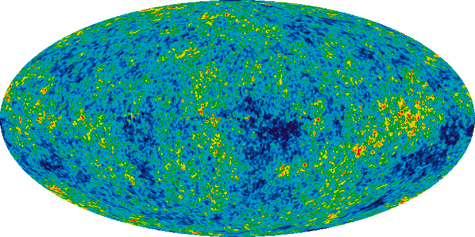

<section>

	
Der bisher unentdeckte heilige Gral der modernen Physik. Diese Theorie würde alle drei fundamentalen Konstanten <i>G</i>, <i>c</i>-1 und ℏ umfassen. Es gibt eine ganze Reihe von ambitionierten Anwärtern auf den Thron, allen voran die Stringtheorie und die Schleifenquantengravitation. Allerdings lässt sich für keine dieser beiden Theorien bisher prüfen, ob sie korrekt ist – vermutlich sind am Ende sogar beide falsch, zumindest aber inkomplett. Durch die Kombination der drei fundamentalen Naturkonstanten <i>G</i>, <i>c</i> und ℏ können wir natürliche Einheiten für Raum, Zeit und Masse ableiten, die sogenannten Planck-Einheiten. Dabei stellt sich heraus, dass die Quantengravitation in Größendimensionen relevant wird, die diesen Planck-Einheiten entsprechen. Leider sind diese Skalen extrem weit von allem entfernt, was wir experimentell direkt erschließen können. So liegt die Planck-Länge bei etwa 10–35 Metern, das ist eine geradezu unvorstellbare 1020-mal kleinere Skala als die Größe des Protons.

	

	<h4>Die Theorie von Allem</h4>

	
Was ist die Theorie an der Ecke (<i>G</i>, <i>c</i>-1, ℏ) des Würfels der Physik? Sie sollte mathematisch konsistent und experimentell überprüfbar sein, und zudem alle anderen Theorien, die an den restlichen Ecken des Würfels sitzen, als Grenzfälle enthalten, indem man die Konstanten <i>G</i>, <i>c</i>-1 und ℏ auf geeignete Weise individuell oder in Kombinationen auf Null setzt. Im Deutschen wird diese gesuchte Theorie oft verkürzt als »Weltformel« bezeichnet, obwohl es natürlich a priori unklar ist, ob sie im Falle ihrer Existenz auf einer einzigen Formel basiert. Im Englischen heißt sie dagegen ganz unbescheiden »Theory of Everything«, übersetzt also »Theorie von Allem«.

	
Die Theorie von Allem sollte insbesondere <a href="{{ "/t5-quantenfeldtheorie.html" | relative_url }}">Quantenfeldtheorie</a> und <a href="{{ "/t3-allgemeine-relativitaetstheorie.html" | relative_url }}">Allgemeine Relativitätstheorie</a> vereinen. Die Gravitation soll also ›quantisiert‹ und die Konstante ℏ mit der Gravitation in Verbindung gebracht werden. ›Quantisiert‹ man jedoch die <a href="{{ "/t3-allgemeine-relativitaetstheorie.html" | relative_url }}">Allgemeine Relativitätstheorie</a> in Analogie etwa zur Elektrodynamik auf naive Weise, z.B. indem man über alle möglichen Metriken summiert, führt dies zu unbezähmbaren ›Divergenzen‹, d.h. unendlichen Ausdrücken, die die Voraussagekraft der Theorie vernichten.

	
Die beiden prominentesten aller aktuell verfolgten Ansätze, die diese Schwierigkeiten zu umgehen suchen, sind die Superstringtheorie und die Schleifenquantengravitation. Beiden ist gemein, dass sie von einer experimentellen Überprüfbarkeit weit entfernt sind, und, damit zusammenhängend, dass es jeweils eine ungeheure Vielzahl unterschiedlicher Versionen gibt. Es handelt sich also eher um Theorienklassen als um eindeutig definierte Theorien.

	
Die Superstringtheorie hat ihre Wurzeln in der <a href="{{ "/t5-quantenfeldtheorie.html" | relative_url }}">Quantenfeldtheorie</a>. Deren Punktteilchen werden durch schwingende Saiten, die sogenannten Strings, ersetzt, um die verschiedenen Teilchen der Natur als Schwingungszustände der Strings darstellen zu können. Durch diesen Ansatz verschwinden die Divergenzen, Teilchen- und Gravitationsphysik werden vereint. Ein hypothetisches »Graviton« tritt auf, die Welt wird 10- oder sogar 11-dimensional, und unsere Welt ist nur eine von mindestens 10500 vielen. Einige dieser Welten ähneln dem Standardmodell der Teilchenphysik, aber leider ist darunter bisher noch keine entdeckt, die genau unser Standardmodell liefert. Ein spekulativer Ausweg ist die Idee des Multiversums: Viele dieser möglichen Welten sind demzufolge in nicht miteinander kommunizierenden Paralleluniversen existent. In diesem Szenario wären die vielen bisher unerklärten Parameter des Standardmodells letztlich kontingent bzw. dadurch festgelegt, dass sie intelligentes Leben ermöglichen (anthropisches Prinzip).

	

		

			<figure class="image center"><figcaption>Kosmische Hintergrundstrahlung.</figcaption></figure>
		

	

	
Die Schleifenquantengravitation hat ihre Wurzeln in der <a href="{{ "/t3-allgemeine-relativitaetstheorie.html" | relative_url }}">Allgemeinen Relativitätstheorie</a>. Letztere wird direkt quantisiert; dies führt zu einer Art ›Quantenschaum‹ auf der Planck-Skala  im Bereich von 10—35 <i>m</i>. Es gibt viele sich teilweise widersprechende Zugänge, aber in bisher keinem eine natürliche Vereinheitlichung mit den Quantenfeldtheorien des Standardmodells. Die Quantenfeldtheorien des Standardmodells müssen gewissermaßen »hinzugeheftet« werden.

	
Benötigt man überhaupt eine Theorie, die <a href="{{ "/t5-quantenfeldtheorie.html" | relative_url }}">Quantenfeldtheorie</a> und <a href="{{ "/t3-allgemeine-relativitaetstheorie.html" | relative_url }}">Allgemeine Relativitätstheorie</a> vereint? In dieser Frage herrscht weitgehende, bejahende Einigkeit in der Physik. Es ist nämlich offensichtlich, dass sowohl die Detailbeschreibung Schwarzer Löcher als auch diejenige des Urknalls die Quantenmechanik erfordern. Zudem ist experimentell zumindest klar, dass noch etwas Grundlegendes im aktuellen Theoriengebäude der Physik fehlt: Es scheint nämlich, als ob ca. 96 Prozent der Materie und der Energie unseres Universums noch unbekannt, oder wie man sagt, ›dunkel‹ wären.

</section>
