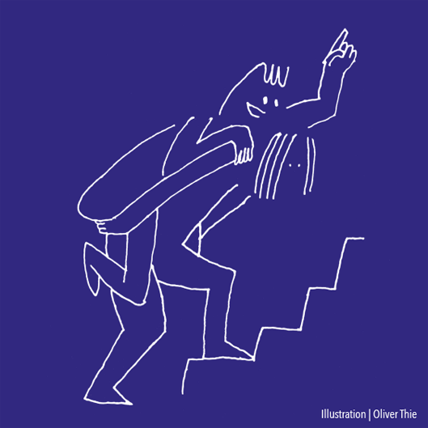

<section>

	
Die Gravitation ist die schwächste der vier Naturkräfte, jedoch die in unserer Welt offensichtlichste. Der Grund hierfür ist, dass sie eine unendliche Reichweite hat und nicht abschirmbar ist: Alle Dinge ziehen sich gegenseitig an. Newton formulierte als erster eine <a href="{{ "/t2-newtonsche-gravitationstheorie.html" | relative_url }}">Gravitationstheorie</a>, die mit ziemlicher Genauigkeit sowohl das Fallen von Objekten auf der Erde als auch die Bahnen der uns unmittelbar umgebenden Himmelskörper beschreibt. Das nach derzeitigem Wissensstand bis auf mögliche Quanteneffekten korrekte Gravitationsgesetz wurde von Einstein aufgestellt. Newtons Theorie ist nur eine Approximation: Einsteins <a href="{{ "/t3-allgemeine-relativitaetstheorie.html" | relative_url }}">Allgemeine Relativitätstheorie</a> umfasst einerseits feine Abweichungen von Newtons Theorie und führt anderseits zu einem vollständig neuartigen Bild des Kosmos, indem sie einen Urknall nahelegt sowie Schwarze Löcher und Gravitationswellen vorhersagt.

	
Dies veränderte unser Verständnis der Raumzeit grundlegend. Raum und Zeit sind nicht länger nur Bühne und Hintergrund der Theorie, sondern werden Teil des physikalischen Geschehens. Die Gravitationskraft als solche verschwindet, und Anziehung wird zu einer Bewegung in einer lokal gekrümmten Raumzeit. Die Raumzeit ist dynamisch: Sie wird durch die Bewegung und Verteilung von Materie und Energie geformt und ist somit untrennbar damit verbunden.

	
Auch in dieser Welt sollten jedoch die Gesetze der Quantenmechanik gelten. Dabei ist die <a href="{{ "/t7-nichtrelativistische-quantengravitation.html" | relative_url }}">Nichtrelativistische Quantengravitation</a> in unserem Würfelmodell nicht besonders spannend, da sie unproblematisch ist. Eine quantenmechanische Verallgemeinerung der <a href="{{ "/t3-allgemeine-relativitaetstheorie.html" | relative_url }}">Allgemeinen Relativitätstheorie</a> zu finden, stellt dagegen eine der großen heutigen Herausforderungen dar: Dies würde im Rahmen des Würfelmodells zu einer <a href="{{ "/t8-theorie-von-allem.html" | relative_url }}">Theorie von Allem</a> führen. Versuche, eine solche Theorie konsistent zu formulieren, wie die Stringtheorie oder Quantenschleifengravitation, sind bisher jedoch erfolglos.

	
Die <a href="{{ "/t8-theorie-von-allem.html" | relative_url }}">Theorie von Allem</a> sollte eine Einsicht darüber liefern, was die Raumzeit selbst ist – wie und aus welchen Prinzipien sich diese auf kleinsten Skalen herausbildet. Das Universum ist also nicht unabhängig von den darin befindlichen Entitäten, sondern damit verschmolzen. Bühne und Akteure können nicht voneinander getrennt werden.

</section>
