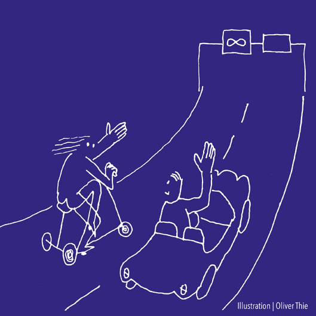

<section>

	
Können wir uns eine Welt ohne Gravitation vorstellen? Die Gravitation ist die schwächste Kraft, aber sie lässt sich nicht abschirmen. Allerdings gibt es Zustände, in denen man scheinbar gravitationslose Welten erzeugen kann: zum Beispiel den Parabelflug eines Flugzeugs, auf dem im Scheitelpunkt Schwerelosigkeit eintritt. Diese Welt ist ein solcher Parabelflug, indem von der schwächsten und doch im Alltag offensichtlichsten der vier Naturkräfte, der Gravitation, abstrahiert wird.

	

Wir befinden uns auf der Seite <i>G</i>=0 des Würfels. Sie wird definiert durch vier, farblich unterschiedlich markierte Theorien, die zunächst keine Aussage über die gravitative Wechselwirkung machen: Die <a href="{{ "/t1-newtonsche-mechanik.html" | relative_url }}">Newtonsche Mechanik</a>, die <a href="{{ "/t6-quantenmechanik.html" | relative_url }}">Quantenmechanik</a>, die <a href="{{ "/t4-spezielle-relativitaetstheorie.html" | relative_url }}">Spezielle Relativitätstheorie</a> und die <a href="{{ "/t5-quantenfeldtheorie.html" | relative_url }}">Quantenfeldtheorie</a>, welche die komplexe Welt aller bekannten Elementarteilchen enthält.

Warum oder wie aber lässt sich Physik erfolgreich betreiben, ohne die Gravitation zu berücksichtigen? Während eine makroskopische Welt ohne Gravitation kaum vorstellbar ist, kann in der mikroskopischen Welt der Teilchenphysik darauf verzichtet werden. So werden in der <a href="{{ "/t6-quantenmechanik.html" | relative_url }}">Quantenmechanik</a> die strengen Bahnen der <a href="{{ "/t1-newtonsche-mechanik.html" | relative_url }}">Newtonsche Mechanik</a> in stochastische Prozesse aufgelöst, allerdings ohne dass dabei die Gravitation ins Spiel kommt. Die <a href="{{ "/t4-spezielle-relativitaetstheorie.html" | relative_url }}">Spezielle Relativitätstheorie</a> verallgemeinert die Raum-Zeitstruktur Galileis, ebenfalls ohne Berücksichtigung der Gravitation. Folglich spielt die Schwerkraft auch in der <a href="{{ "/t5-quantenfeldtheorie.html" | relative_url }}">Quantenfeldtheorie</a> als die Vereinheitlichung von <a href="{{ "/t4-spezielle-relativitaetstheorie.html" | relative_url }}">Spezieller Relativitätstheorie</a> und <a href="{{ "/t6-quantenmechanik.html" | relative_url }}">Quantenmechanik</a> keine Rolle.

	

Raum und Zeit sind in der <i>G</i>=0-Welt die Bühne, auf der sämtliche Ereignisse stattfinden. Körper bewegen sich klassisch oder quantenmechanisch, Kräfte wirken zwischen diesen Körpern, aber Raum und Zeit bleiben hiervon vollkommen unberührt. Theorien dieser <i>G</i>=0-Welt können Aussagen über die lokale Beschaffenheit dieser raumzeitlichen Bühne machen. So kann beispielsweise in der <a href="{{ "/t5-quantenfeldtheorie.html" | relative_url }}">Quantenfeldtheorie</a> das Verhalten von bewegten Körpern bei Raumspiegelung oder Zeitumkehr oder in der <a href="{{ "/t4-spezielle-relativitaetstheorie.html" | relative_url }}">Speziellen Relativitätstheorie</a> die Abhängigkeit von Zeit und Raum vom Beobachter bestimmt werden. Allerdings verändern Theorien der <i>G</i>=0-Welt mit ihren Aussagen die Bühne nicht, sie bleibt davon unabhängig.

  

</section>
